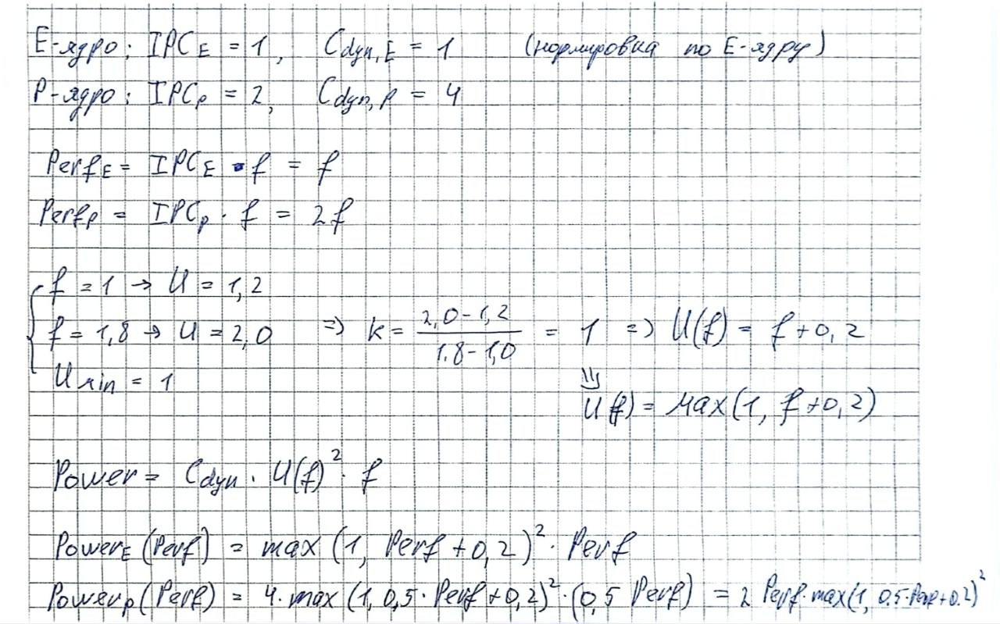
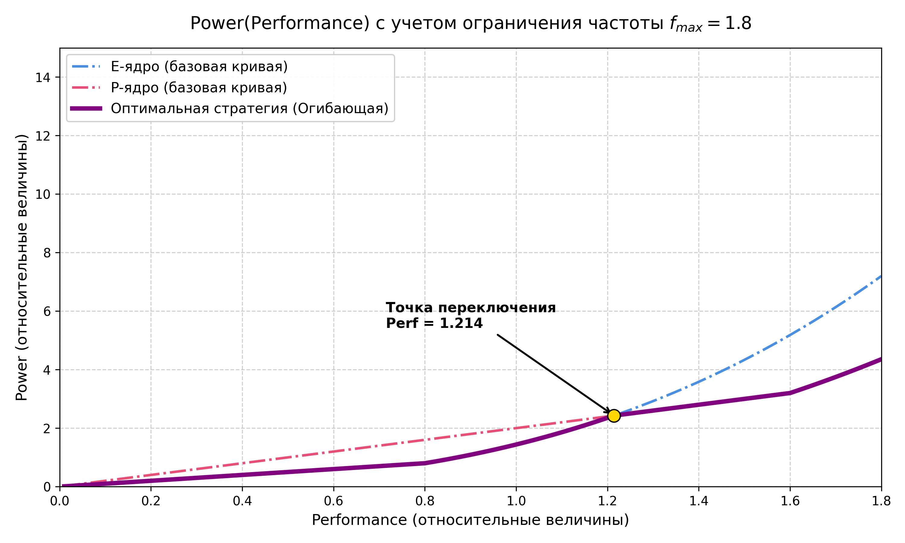

# 1



# 2

### CPP example:
```cpp
int sum(int* arr, int n) {
    int s = 0;
    for(int i = 0; i < n; ++i) {
        s += arr[i];
    }
    return s;
}
```

[godbolt](https://godbolt.org/): risc-v 32-bits + -O1 -march=rv32i -mabi=ilp32
```asm
sum(int*, int):
        addi    sp,sp,-16
        sw      ra,12(sp)
        sw      s0,8(sp)
        sw      s1,4(sp)
        mv      s1,a0
        mv      s0,a1
        call    external_call()
        ble     s0,zero,.L4
        mv      a5,s1
        slli    s0,s0,2
        add     a3,s1,s0
        li      a0,0
.L3:
        lw      a4,0(a5)
        add     a0,a0,a4
        addi    a5,a5,4
        bne     a5,a3,.L3
.L1:
        lw      ra,12(sp)
        lw      s0,8(sp)
        lw      s1,4(sp)
        addi    sp,sp,16
        jr      ra
.L4:
        li      a0,0
        j       .L1
```

external_call чтобы заставить использовать стек.


HW_1 делал в последнюю очередь, его не успел доделать(
