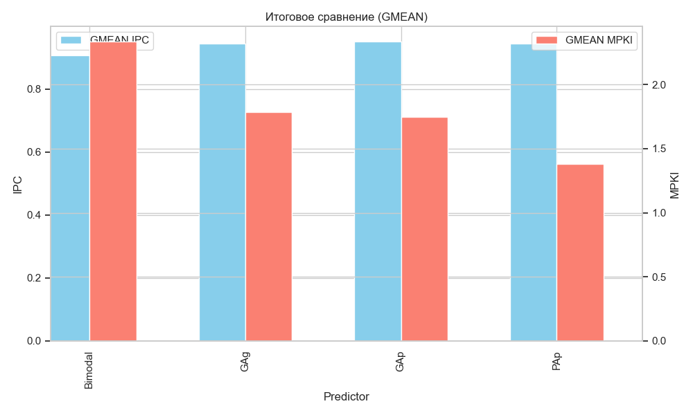
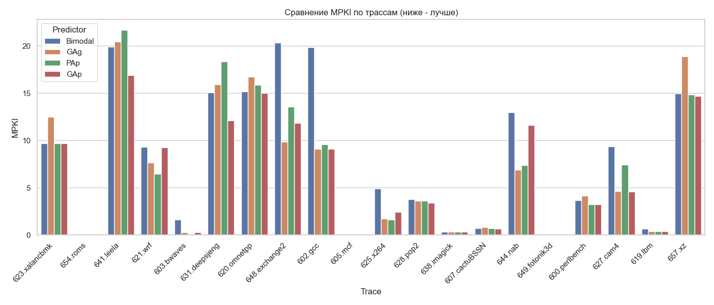
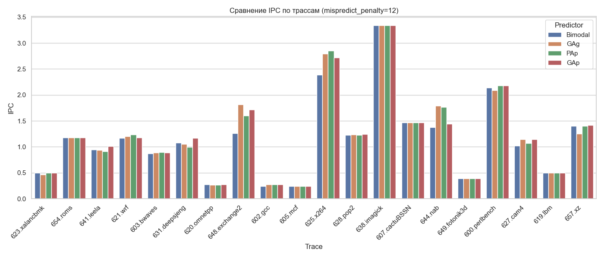

# Патч с реализацией
Патч с реализацией в ChampSim: [ссылка](https://github.com/alexzhelyapov1/ChampSim/commit/9d99078218e82bc0cbb8d41dc81e5dfa7c5782dd).
- https://github.com/alexzhelyapov1/ChampSim/tree/custom-branch/branch/gag
- https://github.com/alexzhelyapov1/ChampSim/tree/custom-branch/branch/gap
- https://github.com/alexzhelyapov1/ChampSim/tree/custom-branch/branch/pap

# Отчет

- `mispredict_penalty = 12` выставлен в champsim_config.json
- одинаковый аппаратный бюджет (4kb)

## Расчет аппаратного бюджета
0. Базовый `bimodal`: 16384 записей 2-битных насыщающихся счетчиков:
   * Бюджет: $16384 \times 2 = \mathbf{32768}$ **бит** (~4 КБайт).
1. **GAg:** 1 глобальный регистр истории (14 бит) + Глобальная PHT ($2^{14}$ записей $\times$ 2 бита). 
   * *Размер:* $14 + 16384 \times 2 = \mathbf{32782}$ **бита**.
2. **PAp:** Таблица истории адресов (512 записей $\times$ 5 бит) + Массив PHT (512 таблиц $\times$ $2^5$ записей $\times$ 2 бита).
   * *Размер:* $2560 + 32768 = \mathbf{35328}$ **бит**.
3. **GAp:** 1 глобальный регистр (5 бит) + Массив PHT (512 таблиц $\times$ $2^5$ записей $\times$ 2 бита).
   * *Размер:* $5 + 32768 = \mathbf{32773}$ **бита**.

---

## Итоговые результаты (GMEAN)

| Predictor | IPC | MPKI |
| :--- | :--- | :--- |
| **Bimodal** | 0.906847 | 2.334462 |
| **GAg** | 0.945273 | 1.786344 |
| **PAp** | 0.944152 | **1.380656** |
| **GAp** | **0.951300** | 1.745797 |

### Анализ сводных данных (Парадокс метрик)
- Все двухуровневые предикторы уверенно обошли базовый `bimodal` по точности и производительности
- **PAp** выдала лучшую среднюю точность, про уступила по ICP
- **GAg** выдал лучшую IPC.

---

## Анализ по трассам

### Сравнение MPKI (Точность)

1. На регулярных трассах PAp показал себя очень хорошо, т.к. хорошо усваивает короткие циклы благодаря локальной истории. Самое ярко выраженное на трассе `603.bwaves` ~0.01.
2. На сложном коде (например `641.leela`) PAp провалился из-за сильного ограничения бюджета (очень большой алиасинг разрушил историю)
3. На сложных целоцисленных трассах (`602.gcc`) GAg и GAp обошли PAp благодаря длинной истории.

### Сравнение IPC (Производительность)

- На memory-bound трассах типа `603.bwaves` или `619.lbm` штраф в 12 тактов прячется за сотнями тактов ожидания данных из LLC/DRAM
- На compute-bound трассах тип `648.exchange2` где много ветвлений победа GAg и GAp над PAp по точности дала огромный прирост скорости

### Сравнение теории и практики

Перед проведением эксперимента были сформированы теоретические ожидания, основанные на архитектурных особенностях предикторов и введенном жестком лимите памяти (~4 КБ). Сравним их с полученными фактами:

**1. Bimodal**
* **Ожидание:** Будет плох на сложных трассах (не видит зависимостей), но будет норм на простых программах с большими циклами.
* **Факт (Подтвердилось):** Bimodal ожидаемо занял последнее место (GMEAN MPKI 2.33, GMEAN IPC 0.906)

**2. GAg**
* **Ожидание:** Глубокая история - отлично справится с целочисленными трассами со сложной логикой
* **Факт (Подтвердилось):** На графике MPKI для трассы `602.gcc` Bimodal выдает около 20 ошибок на 1000 инструкций, GAg снижает это значение почти вдвое (до ~10)

**3. PAp**
* **Ожидание:** В теории идеал. На практике, из-за урезания истории до 5 бит и таблицы до 512 адресов, ожидался провал на сложных трассах из-за коллизий (aliasing), и хорошая работа на коротких циклах.
* **Факт (Подтвердилось):** На алгоритмах со сложным ветвлением PAp даже хуже, чем примитивный Bimodal. На регулярных циклах отличная точность

**4. GAp**
* **Ожидание:** Что-то среднее, т.к. 5 бит глобальной истории маловато для победы над GAg.
* **Факт (Неожиданно):** GAp лучший по производительности (GMEAN IPC = 0.951). Короткая глобальная картина программы + персональная таблица для каждого адреса дает наилучший компромисс
