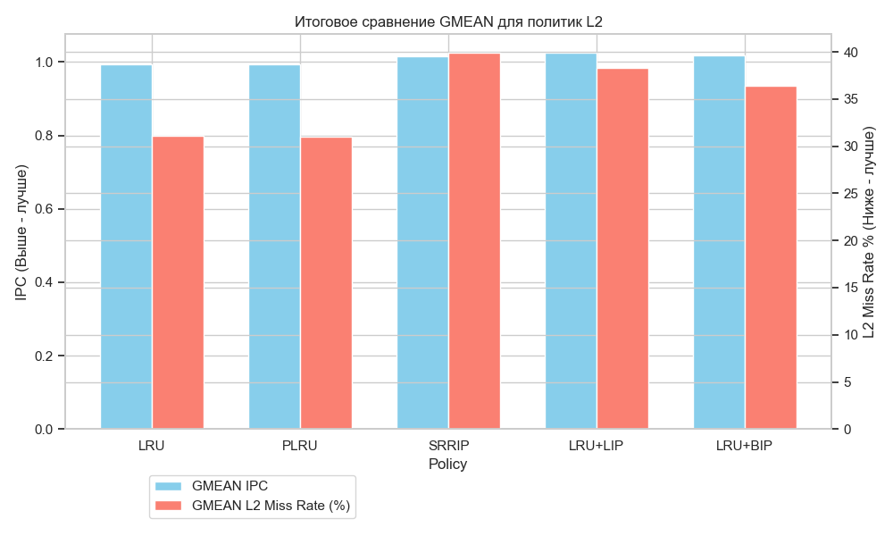
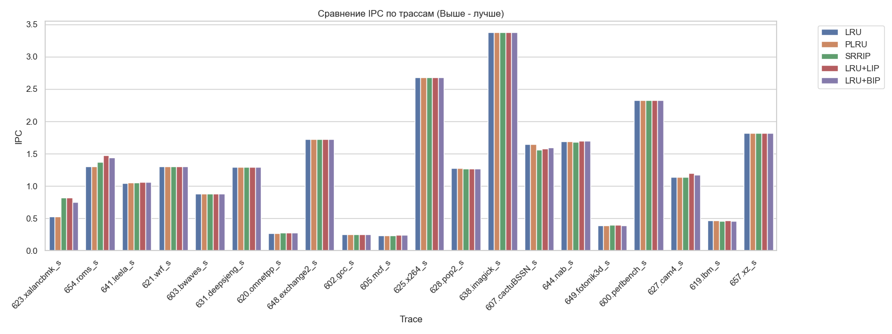
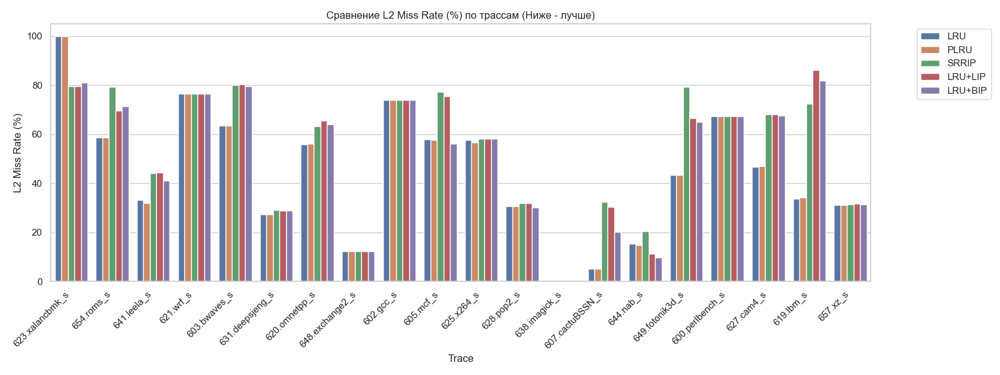

# Патч с реализацией
Патч с реализацией в ChampSim: [ссылка](https://github.com/alexzhelyapov1/ChampSim/commit/9d99078218e82bc0cbb8d41dc81e5dfa7c5782dd).
- https://github.com/alexzhelyapov1/ChampSim/tree/custom-branch/replacement/lru
- https://github.com/alexzhelyapov1/ChampSim/tree/custom-branch/replacement/lru_bip
- https://github.com/alexzhelyapov1/ChampSim/tree/custom-branch/replacement/lru_lip
- https://github.com/alexzhelyapov1/ChampSim/tree/custom-branch/replacement/plru
- https://github.com/alexzhelyapov1/ChampSim/tree/custom-branch/replacement/srrip

# Отчет

## Сводные результаты (GMEAN)

| Политика | GMEAN IPC | GMEAN L2 Miss Rate (%) |
| :--- | :--- | :--- |
| **LRU (Baseline)** | 0.9944 | **31.07%** |
| **PLRU** | 0.9943 | 30.99% |
| **SRRIP** | 1.0155 | 39.87% |
| **LRU+LIP** | **1.0244** | 38.35% |
| **LRU+BIP** | 1.0181 | 36.40% |

---

## LRU vs Pseudo-LRU

Теория: PLRU требует всего $N-1$ бит состояния на кэш-сет (вместо $N \log_2 N$ у LRU), является аппаратной аппроксимацией -> характеристики должны быть почти идентичны LRU с небольшими ухудшениями.

Практика это подтверждает. Разница IPC: $0.0001$. Разница miss rate: $0.08\%$.
Причем это экономит приличную часть плозади кристала и энергопотребления. Короче круто.

---

## Борьба с кэш-загрязнением (LIP, BIP, SRRIP)

### Scan-Resistance
Недостаток LRU — уязвимость к сканирующим (streaming) нагрузкам.
* На трассе **`623.xalancbmk_s`** Miss Rate у LRU достигает почти 100%. Производительность падает до ~0.5 IPC.
* Политики **LIP, BIP и SRRIP** вставляют эти потоковые данные с низким приоритетом.
* **Результат:** На `623.xalancbmk_s` Miss Rate падает до 80%, а **IPC с 0.5 до ~0.8 (прирост >60%)**. Аналогично на `654.roms_s`.

### LIP
Недостаток - при полной смене рабочего множества новые данные постоянно вставляются в позицию LRU, и вытесняются до повторного обращения. Видно на трассе `619.lbm_s`. У LRU miss rate ~35%, у LIP > 85%.

### BIP
BIP дает 3% шанс сразу попасть в MRU новым строкам и зацепиться новому рабочему множеству. BIP выиграл за счет этого на `644.nab_s` и `607.cactuBSSN_s` по сравнению с LIP, снизив miss rate с 30% до 20%.

### SRRIP
SRRIP подтвердил что одна из лучших политик. 2битные счетчики RRPV + предсказания дальних обращений.
Но он уступил LIP в пиковом IPC на некоторых трассах, но оказался более стабильным.

---

## 5. Итоговые выводы

1. LRU устарел и не подходит для L2, т.к. они фильтруют трафик от L1 и часто сталкиваются со сканирующим потоком.
2. PLRU идеальная замена и стандарт
3. Изменение политики вставки может очень сильно влиять (60%) за счет защиты от вымывания
4. BIP и SRRIP хороший баланс, не боятся сканирования и адаптируются к смене рабочего множества.
